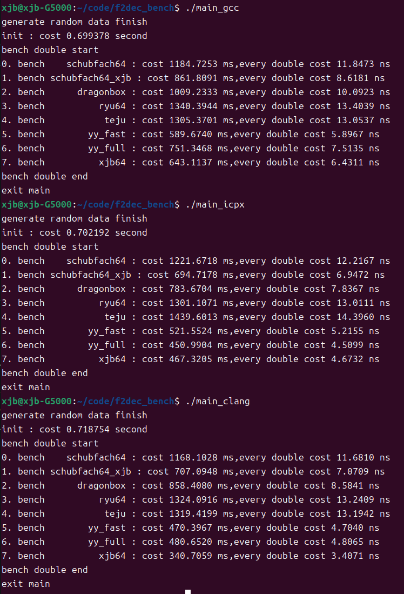

a simple demo for bench double to shortest decimal algorithm.

algorithm     | Description
--------------|-----------
[schubfach](https://github.com/abolz/Drachennest) | Raffaello Giulietti's algorithm.Origin source code from https://github.com/c4f7fcce9cb06515/Schubfach
schubfach_xjb  | It is improved by schubfach and has the same output result.
[ryu](https://github.com/ulfjack/ryu) | Ulf Adams's [Ryū algorithm](https://dl.acm.org/citation.cfm?id=3192369).
[dragonbox](https://github.com/jk-jeon/dragonbox) | Junekey Jeon's CPP implementation.
[yy_fast](https://github.com/ibireme/c_numconv_benchmark.git) | yy's algorithm , Some calculation steps have been modified. origin link : https://github.com/ibireme/c_numconv_benchmark/blob/master/vendor/yy_double/yy_double.c
[yy_full](https://github.com/ibireme/c_numconv_benchmark.git) | Same as yy_fast.
[teju](https://github.com/cassioneri/teju_jagua.git) | youtube  link : https://www.youtube.com/watch?v=fPZ1ZdA7Iwc . An academic paper will be written to provide proof of correctness.
[xjb] | Chinese version proof paper : print_acc.7z

run :
(1)benchmark double:
1. set variable BENCH_DOUBLE = 1
2. select a compiler
gcc: `make g`
icpx:`make i`
clang:`make c`

(2)benchmark float:
1. set variable BENCH_DOUBLE = 0
2. select a compiler
gcc: `make g`
icpx:`make i`
clang:`make c`

benchmark results :
``CPU : AMD R7 7840H , OS : ubuntu 24.04``
``compiler : (1)gcc13.3 (2)icpx 2025.0.4 (3)clang 18.1.3 ``

double:

float:

author : Xiang Jun Bo (xjb) , China , email : 1302035400@qq.com
date : 2025.5.13